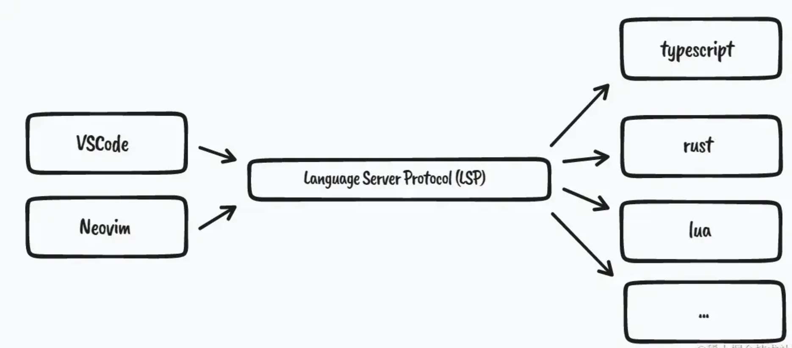
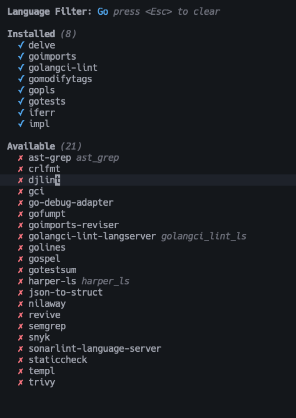
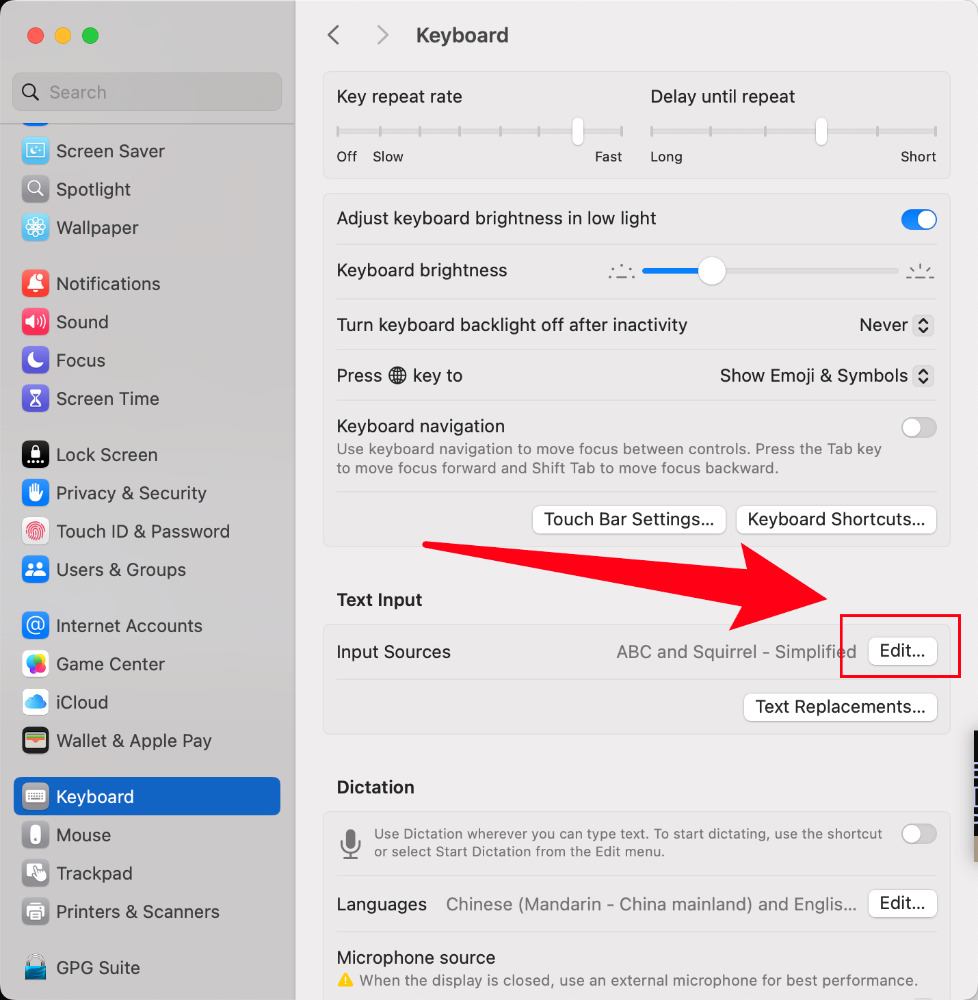
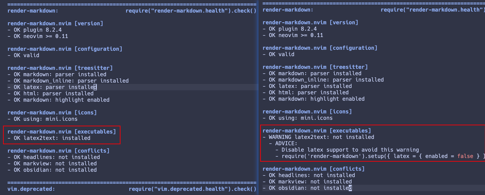

# NVIM

又爱又恨啊，被我自己之前的版本给坑了，所以这次我决定重新来一遍。

总结了之前的问题，我过于纠结自己写一套完美的 lua 的 nvim 配置，从而导致很多情况下，没有能够及时跟进，所以我决定尝试使用成熟的 nvim 项目。

## 实用当前的 neovim 的版本

我决定尝试：

1. [AstroNvim](https://docs.astronvim.com/);
2. [InsisVim](https://github.com/nshen/InsisVim)

目前先搞这两个，让我们开始吧！

### AstroNvim

一切根据官网配置，目前我搞了一套配置在这个文件当前目录下的 `astronvim` 文件夹中。

#### 安装

首先复制配置，命令如下：

```shell
mv ~/.config/nvim ~/.config/nvim.bak
```

清理 neovim 的文件夹，命令如下：

```shell
mv ~/.local/share/nvim ~/.local/share/nvim.bak
mv ~/.local/state/nvim ~/.local/state/nvim.bak
mv ~/.cache/nvim ~/.cache/nvim.bak
```

clone 项目，当然我已经提前复制到我的 dotfiles 项目中了。命令如下：

```shell
git clone --depth 1 https://github.com/AstroNvim/template ~/.config/nvim
rm -rf ~/.config/nvim/.git
nvim
```

当然，我自己在 dotfiles 中也有，可以使用命令如下：

```shell
ln -s ~/.dotfiles/nvim/InsisVim ~/.config/nvim
```

### InsisVim

这个项目，我选择 fork 了 [原项目](https://github.com/nshen/InsisVim)。然后作为本项目的 submodule。

本项目在整个 dotfiles 的目录为 `nvim/InsisVim`。

#### 安装

首先复制配置，命令如下：

```shell
ln -s ~/.dotfiles/nvim/InsisVim ~/.config/nvim
```

## 我的 lsp

### 我的 golang

想要在 neovim 中配置代码补全、代码悬停、代码提示等功能，首先需要了解什么是 LSP（Language Server Protocol）语言服务协议？

在 LSP 出现之前，传统的 IDE 都要为其支持的每个语言实现类似的代码补全、文档提示、跳转到定义等功能，不同的 IDE 做了很多重复的工作，并且兼容性也不是很好。 LSP 的出现将编程工具解耦成了 Language Server 与 Language Client 两部分。定义了编辑器与语言服务器之间交互协议。



Client 专注于显示样式实现， Server 负责提供语言支持，包括常见的自动补全、跳转到定义、查找引用、悬停文档提示等功能。

而我们所说的 Neovim 内置 LSP 就是说 Neovim 内置了一套 Language Client 端的实现，这样我们就可以连接到和 VSCode 相同的第三方 language servers ，实现高质量的语法补全等功能。

我先说一下我目前的状况：

|                  | 工具                      | 优点                           | 缺点                   | 推荐使用场景                     | 是否已安装 |
| ---------------- | ------------------------- | ------------------------------ | ---------------------- | -------------------------------- | ---------- |
| **语言服务器**   | gopls                     | 提供智能的代码补全和导航       | 需要较新的Go版本       | 大多数IDE的Go语言支持            | ✅          |
|                  | harper-ls                 | 高性能语言服务器               | 社区支持有限           | 提供代码智能提示和补全           | ❌          |
|                  | golangci-lint-langserver  | 集成于语言服务器的多种Lint工具 | 配置复杂               | IDE中Lint检查                    | ❌          |
| **调试工具**     | delve                     | 强大的调试功能                 | 学习曲线较高           | 需要代码的逐行调试               | ✅          |
|                  | go-debug-adapter          | VS Code的Go调试适配器          | 配置复杂               | VS Code中调试Go                  | ❌          |
| **格式化工具**   | goimports                 | 自动导入/移除包，代码格式化    | 简单配置有时不足       | 自动整理导入包和简单的代码格式化 | ✅          |
|                  | crlfmt                    | 格式化文件引用和注释           | 使用场景有限           | 特定格式的代码文件               | ❌          |
|                  | gofumpt                   | 格式化Go代码，更多严格的规则   | 规则有时严格           | 需要严格格式化规范的项目         | ❌          |
|                  | goimports-reviser         | 自动导入和代码格式化结合       | 与goimports功能重叠    | 结合导入管理和格式化             | ❌          |
|                  | golines                   | 自动折叠长行代码               | 仅适用于长行代码格式化 | 长行代码自动格式化               | ❌          |
| **静态分析工具** | golangci-lint             | 综合多种Lint工具，支持并行处理 | 配置复杂               | 全面代码质量检查                 | ✅          |
|                  | ast-grep                  | 树语法解析，强大的模式匹配     | 初学者上手有难度       | 代码结构和模式匹配               | ❌          |
|                  | djlint                    | 针对Django模板的Lint工具       | 仅适用Django模板       | Django项目中的模板检查           | ❌          |
|                  | gci                       | 导入声明分组和排序             | 功能相对简单           | 导入分组整理                     | ❌          |
|                  |                           |                                |                        |                                  |            |
|                  | nilaway                   | NIL值检查工具                  | 专用于NIL值处理        | 检查NIL值使用                    | ❌          |
|                  | revive                    | 高性能的Go Lint工具            | 配置复杂               | 代码质量检查                     | ❌          |
|                  | semgrep                   | 语法级别的代码扫描             | 初学者上手有难度       | 代码安全和风格检查               | ❌          |
|                  | snyk                      | 开源依赖和安全性检测           | 使用需要注册           | 依赖安全检查                     | ❌          |
|                  | sonarlint-language-server | 高级代码质量和安全分析         | 配置复杂               | 代码质量和安全分析               | ❌          |
|                  | staticcheck               | 深度的代码静态分析             | 配置复杂               | 深度代码质量检查                 | ❌          |
| **代码生成工具** | gomodifytags              | 根据结构体标签生成代码         | 专用于标签，功能单一   | 根据结构体生成代码               | ✅          |
|                  | gotests                   | 自动生成测试代码               | 模板较为基础           | 快速生成测试代码                 | ✅          |
|                  | iferr                     | 快速生成错误处理代码           | 仅适用于错误处理       | 处理错误的快捷方式               | ✅          |
|                  | impl                      | 生成接口实现的代码             | 仅适用于接口实现       | 接口实现快速生成                 | ✅          |
|                  | json-to-struct            | 从JSON生成Go结构体             | 专用于JSON处理         | 快速创建Go结构体                 | ❌          |
|                  | templ                     | 模板化代码生成                 | 初学者上手难度较大     | 统一代码生成策略                 | ❌          |
| **测试工具**     | gotestsum                 | 提供更详细的测试输出           | 学习曲线略高           | 需要详细测试输出的项目           | ❌          |
| **安全分析工具** | trivy                     | 容器和依赖漏洞扫描             | 学习曲线较高           | 容器和依赖安全扫描               | ❌          |

#### 一些 lsp 和 golang 开发工具

过滤了一下在 mason 中的 golang 开发工具如下图所示：



其中包括一些 LSP 服务器、linter 和其他实用工具。

##### LSP

- **`gopls`:** 这是 Google 官方开发的 Go 语言 LSP 服务器，功能全面且稳定，是 Go 开发的首选 LSP 服务器。
  - **优点：**功能丰富，包括代码补全、跳转到定义、查找引用、代码诊断、代码格式化等；性能优秀，对大型项目也能良好支持；持续更新和维护。
  - **缺点：**资源占用相对较高。
  - **推荐场景：**所有 Go 开发场景，强烈推荐作为主力 LSP 服务器。
- **`golangci_lint_ls` (golangci-lint-langserver):** 这是一个基于 `golangci-lint` 的 LSP 服务器，可以提供丰富的代码静态分析功能。
  - **优点：**集成多种 linter，可以进行全面的代码检查；可配置性强，可以根据项目需求定制 linter 规则。
  - **缺点：**配置较为复杂；性能可能不如 `gopls`。
  - **推荐场景：**对代码质量要求较高的项目，需要进行更严格的代码静态分析。
- **`harper_ls` (harper-ls):** Harper 是一个实验性的 Go 语言 LSP 服务器，旨在提供更快的代码补全和更丰富的功能。
  - **优点：**代码补全速度快；一些实验性功能可能对特定场景有用。
  - **缺点：**稳定性不如 `gopls`；功能可能不如 `gopls` 完善。
  - **推荐场景：**想要尝试新功能的用户，或者对代码补全速度有较高要求的用户。

> 还有一些其他的 Go 工具，它们并非 LSP 服务器，但也能在 Go 开发中发挥重要作用：

##### **调试**

- **`delve`:** Go 语言的调试器，功能强大，支持各种调试功能，例如断点、单步执行、查看变量值等。
  - **优点：**功能全面，支持多种调试方式；性能优秀。
  - **缺点：**需要一定的学习成本。
  - **推荐场景：**所有 Go 项目，特别是需要进行复杂调试的项目。

##### **代码格式化**

- **`golangci-lint`:** 一个集成了多种 linter 的工具，可以进行全面的代码静态分析。
  - **优点：**一次性运行多个 linter，提高效率；可配置性强，可以根据项目需求定制 linter 规则。
  - **缺点：**配置较为复杂。
  - **推荐场景：**对代码质量要求较高的项目。

- **`gofumpt`:** Go 代码格式化工具，比 `gofmt` 更严格，强制执行更一致的代码风格。
  - **优点:** 更严格的代码风格，提高代码可读性；基于 `gofmt`，兼容性好。
  - **缺点：** 过于严格的风格可能不符合某些团队的习惯。
  - **推荐场景：** 追求极致代码风格一致性的项目。
- **`goimports`:** 自动管理 Go 代码的 import 语句，并格式化代码。
  - **优点：** 简化 import 管理；格式化代码。
  - **缺点：** 功能相对单一。
  - **推荐场景：** 所有 Go 项目，几乎是必备工具。
- **`goimports-reviser`:** `goimports` 的改进版，可以根据配置自动修改 import 路径。
  - **优点：** 更灵活的 import 管理。
  - **缺点：** 配置较为复杂。
  - **推荐场景：** 需要对 import 路径进行精细控制的项目。
- **`crlfmt`:** 用于检测和修复 CRLF 行尾的工具。
  - **优点：** 确保跨平台兼容性。
  - **缺点：** 仅适用于特定场景。
  - **推荐场景：** 跨平台协作的项目。

##### **静态分析/Linter**

- **`golangci-lint`:** 一个集成了多种 linter 的工具，可以进行全面的代码静态分析。
  - **优点：** 一次性运行多个 linter，提高效率；可配置性强。
  - **缺点：** 配置较为复杂。
  - **推荐场景：** 对代码质量要求较高的项目。
- **`staticcheck`:** 一个 Go 代码静态分析工具，可以发现代码中的潜在问题。
  - **优点：** 规则全面，可以发现很多常见错误。
  - **缺点：** 可能误报。
  - **推荐场景：** 所有 Go 项目。
- **`nilalway`:** 用于检测可能出现 nil 指针解引用的工具。
  - **优点：** 提高代码安全性。
  - **缺点：** 可能误报。
  - **推荐场景：** 对代码安全性要求较高的项目。
- **`revive`:** 一个可定制的 Go linter。
  - **优点：** 可定制性强。
  - **缺点：** 需要一定的配置。
  - **推荐场景：** 需要定制 linter 规则的项目。
- **`golines`:** 用于强制执行代码行长度限制的工具。
  - **优点：** 提高代码可读性。
  - **缺点：** 过于严格的限制可能影响代码编写。
  - **推荐场景：** 对代码风格有严格要求的项目。
- **`gospel`:** 用于根据注释生成 Go 测试代码的工具。
  - **优点：** 提高测试效率。
  - **缺点：** 需要特定的注释格式。
  - **推荐场景：** 注重测试的项目。
- **`gotestsum`:** 用于汇总 Go 测试结果的工具。
  - **优点：** 方便查看测试结果。
  - **缺点：** 仅用于测试阶段。
  - **推荐场景：** 所有 Go 项目。
- **`djlint`:** 用于检查 Django 模板的工具 (与 Go 无关)。

##### **安全扫描**

- **`snyk`:** 用于检测代码中安全漏洞的工具。
  - **优点：** 可以发现很多常见的安全漏洞。
  - **缺点：** 需要联网使用。
  - **推荐场景：** 对安全性要求较高的项目。

##### **其他**

- **`gomodifytags`:** 用于修改 Go 结构体标签的工具，可以方便地添加、删除或修改结构体字段的标签。
  - **优点：**简化结构体标签管理，提高开发效率。
  - **缺点：**仅适用于特定场景。
  - **推荐场景：**需要频繁修改结构体标签的项目，例如 Web 开发、数据库操作等。
- **`iferr`:** 用于检查错误处理的工具，可以帮助开发者避免遗漏错误处理。
  - **优点：**提高代码健壮性，减少潜在的错误。
  - **缺点：**可能过于严格，需要根据实际情况进行调整。
  - **推荐场景：**对代码健壮性要求较高的项目。
- **`impl`:** 用于生成接口实现代码的工具，可以根据接口定义自动生成实现代码框架。
  - **优点：**提高开发效率，减少重复劳动。
  - **缺点：**生成的代码可能需要手动修改和补充。
  - **推荐场景：**需要频繁实现接口的项目。

- **`ast-grep` (ast_grep):** 基于抽象语法树 (AST) 的代码搜索和重构工具。
  - **优点：** 更精确的代码搜索和重构。
  - **缺点：** 需要一定的学习成本。
  - **推荐场景：** 需要进行复杂代码重构的项目。
- **`go-debug-adapter`:** 用于调试 Go 代码的适配器。
  - **优点：** 方便调试。
  - **缺点：** 通常由 IDE 或编辑器集成。
  - **推荐场景：** 所有 Go 项目。
- **`json-to-struct`:** 用于将 JSON 数据转换为 Go 结构体的工具。
  - **优点：** 简化数据转换。
  - **缺点：** 仅适用于特定场景。
  - **推荐场景：** 需要处理 JSON 数据的项目。
- **`templ`:** 用于管理 Go 模板的工具。
  - **优点：** 方便管理模板。
  - **缺点：** 仅适用于使用 Go 模板的项目。
  - **推荐场景：** 使用 Go 模板的项目。
- **`trivy`:** 用于扫描容器镜像中的漏洞的工具 (与 Go 无关)。

### 我的 lua

我的配置很有意思，如下：

```lua
local utils = require "astrocore"

local function selene_configured(path)
  return #vim.fs.find("selene.toml", { path = path, upward = true, type = "file" }) > 0
end

---@type LazySpec
return {
  {
    "AstroNvim/astrolsp",
    ---@type AstroLSPOpts
    opts = {
      ---@diagnostic disable: missing-fields
      config = {
        lua_ls = { settings = { Lua = { hint = { enable = true, arrayIndex = "Disable" } } } },
      },
    },
  },
  {
    "nvim-treesitter/nvim-treesitter",
    optional = true,
    opts = function(_, opts)
      if opts.ensure_installed ~= "all" then
        opts.ensure_installed = utils.list_insert_unique(opts.ensure_installed, { "lua", "luap" })
      end
    end,
  },
  {
    "WhoIsSethDaniel/mason-tool-installer.nvim",
    optional = true,
    opts = function(_, opts)
      opts.ensure_installed =
        require("astrocore").list_insert_unique(opts.ensure_installed, { "lua-language-server", "stylua", "selene" })
    end,
  },
  {
    "stevearc/conform.nvim",
    optional = true,
    opts = {
      formatters_by_ft = {
        lua = { "stylua" },
      },
    },
  },
  {
    "mfussenegger/nvim-lint",
    optional = true,
    opts = {
      linters_by_ft = {
        lua = { "selene" },
      },
      linters = {
        selene = { condition = function(ctx) return selene_configured(ctx.filename) end },
      },
    },
  },
}
```

#### 代码静态分析工具：Selene

Selene 是一个用 Rust 编写的快速、现代的 Lua 代码静态分析工具（linter）。旨在帮助开发者编写更正确、更符合规范的 Lua 代码，并尽早发现潜在的错误和代码风格问题。

特别注重诊断的准确性，即便不能识别所有问题，也力求避免误报。

**Selene 的作用**

- **代码规范检查:** Selene 内置了许多规则，用于检查 Lua 代码是否符合最佳实践和常见的代码风格指南。这有助于提高代码的可读性和可维护性。
- **错误检测:** Selene 可以检测一些常见的 Lua 编程错误，例如除以零、未定义的变量、类型错误等，从而减少运行时错误的风险。
- **坏味道识别:** Selene 可以识别一些代码中的“坏味道”，例如过高的圈复杂度、重复代码等，提示开发者进行重构。
- **自定义规则:** Selene 支持自定义规则，开发者可以根据自己的需求添加或修改规则。
- **快速高效:** 由于 Selene 使用 Rust 编写，因此运行速度非常快，可以快速分析大型 Lua 项目。

## 组件

记录一下有用的插件

### mason-null-ls 组件

`mason-null-ls.nvim` 的作用是**桥接 `mason.nvim` 和 `null-ls.nvim` (或者它的继任者 none-ls.nvim)**，简化在 Neovim 中使用这两个插件的过程。它利用 `mason.nvim` 管理和安装 LSP 服务器、linter 和 formatter，然后自动将这些工具配置到 `null-ls.nvim` 中，从而实现开箱即用的代码诊断、格式化和补全功能。

以下是 `mason-null-ls.nvim` 的主要作用和使用方法：

**作用：**

1. **自动安装和配置**: `mason-null-ls.nvim` 可以自动安装 `mason.nvim` 中可用的 LSP 服务器、linter 和 formatter，并自动将其配置到 `null-ls.nvim` 中。这大大简化了配置过程，无需手动为每个工具编写配置代码。
2. **便捷的 API**: `mason-null-ls.nvim` 提供了便捷的 API，例如 `:NullLsInstall <tool>` 命令，可以快速安装和配置指定的工具。
3. **名称转换**: `mason-null-ls.nvim` 会自动转换 `null-ls.nvim` 的 source 名称和 `mason.nvim` 的 package 名称，例如将 `haml_lint` 转换为 `haml-lint`，避免了手动转换的麻烦。
4. **handlers**: 允许用户自定义处理函数，以便对特定工具进行更精细的控制。

### im-select

因爲這個，我接觸了一個很有意思的輸入法，號稱不會侵佔你的隱私。

但是目前，我只能全部使用繁體，就像現在這個樣子，很離譜誒。

首先這個東西，就是一個 im-select.lua 的事情，但是你需要額外下載兩個組件。

1. macism，下載命令如下：

    ```shell
    brew tap laishulu/homebrew
    brew install macism
    ```

2. squirrel，直接上官方網站找到下載地址，然後我使用手動配置的，進入 settings 然後添加中文的 輸入法，如下圖：
    

    

如上就是。

## 解決問題

遇到了一些問題，讓我們慢慢來解決。

### Failed to update registries: GitHubRegistrySource.......

全稱截圖如下：


最終我在 github 上找到了解決方法，[link](https://github.com/williamboman/mason.nvim/issues/1603)。


授權正確就行了。

### render-markdown 组件

最初遇到的问题是 latex2text 没有安装，我使用了如下方案。

需要 LaTeX 支持，`render-markdown.nvim` 实际上依赖的是 Python 包 `pylatexenc`，可以通过以下方式安装：

```shell
# 使用 pipx 安装 (推荐，避免污染系统 Python)
pipx install pylatexenc

# 或者在虚拟环境中安装
python3 -m venv ~/.local/share/nvim/latex-env
source ~/.local/share/nvim/latex-env/bin/activate
pip install pylatexenc
```

然后需要确保 Neovim 能够找到这个包：

```lua
-- 在你的 Neovim 配置中
require('render-markdown').setup({
  latex = {
    enabled = true,
    -- 如果需要，指定 pylatexenc 的路径
    -- executable = vim.fn.expand('~/.local/bin/pylatexenc')
  }
})
```

实际上在这个项目中，我的配置如下：

```
{
  "MeanderingProgrammer/render-markdown.nvim",
  ft = { "markdown", "markdown.mdx" },
  event = "VeryLazy",
  opts = {
    bullet = {
      right_pad = 1,
    },
    latex = {
      enabled = true,
      -- 如果需要，指定 pylatexenc 的路径
      -- executable = vim.fn.expand('~/.local/bin/pylatexenc')
    }
  },
  dependencies = { "nvim-treesitter/nvim-treesitter", "echasnovski/mini.nvim" },
},
```



上面操作完之后，就会出现左边可以下载之后的组件。
