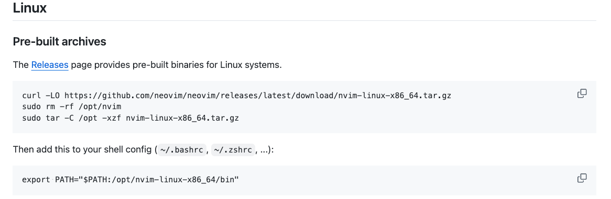

# AstroNvim Template

A template for getting started with [AstroNvim](https://github.com/AstroNvim/AstroNvim)

## Langs

There are some langs I used as following:

- [pack-go](docs/langs/pack-go.md)

## 🛠️ Installation

### Install Neovim

Plz must follow the official ways, [link](https://github.com/neovim/neovim/blob/master/INSTALL.md#linux).



### Make a backup of your current nvim and shared folder

```shell
mv ~/.config/nvim ~/.config/nvim.bak
mv ~/.local/share/nvim ~/.local/share/nvim.bak
mv ~/.local/state/nvim ~/.local/state/nvim.bak
mv ~/.cache/nvim ~/.cache/nvim.bak
```

### Create a new user repository from this template

Press the "Use this template" button above to create a new repository
to store your user configuration.

You can also just clone this repository directly if you do not want to
track your user configuration in GitHub.

### Clone the repository

```shell
git clone git@github.com:Chever-John/AstroNvim.git ~/.config/nvim
```

### Start Neovim

```shell
nvim
```
