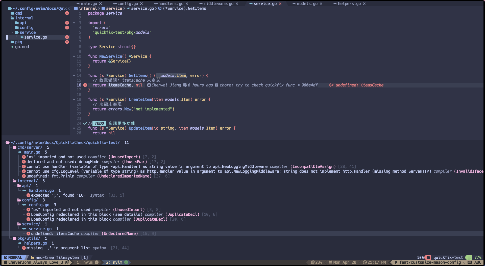
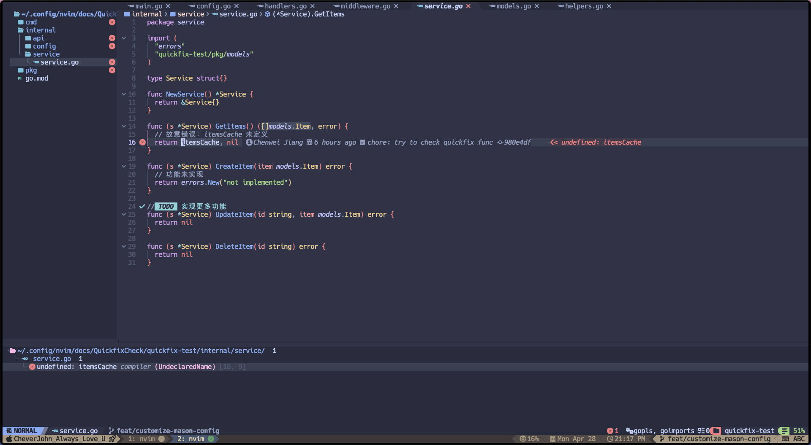
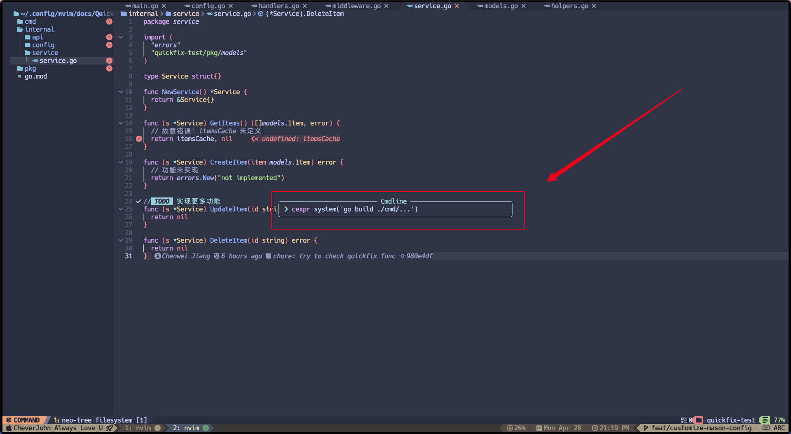
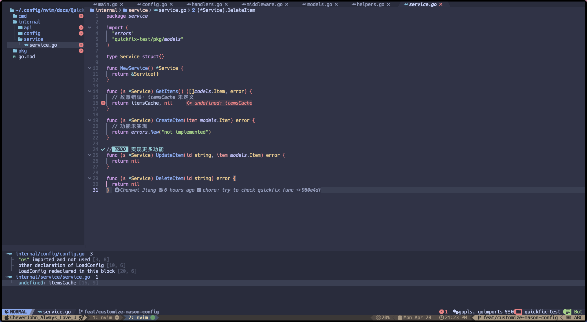
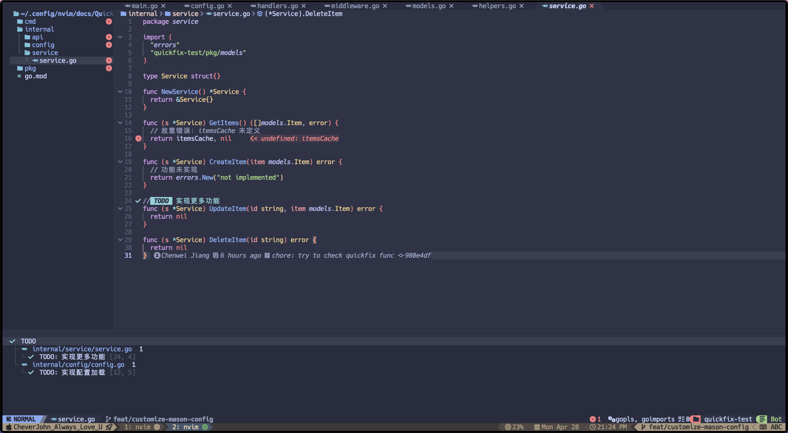

# 测试 Quickfix 功能

但其实，我使用的是 trouble.nvim 插件。

```shell
/.config/nvim/docs/QuickfixCheck/quickfix-test [21:07]
> tree
.
├── cmd
│   └── server
│       └── main.go
├── go.mod
├── internal
│   ├── api
│   │   ├── handlers.go
│   │   └── middleware.go
│   ├── config
│   │   └── config.go
│   └── service
│       └── service.go
└── pkg
    ├── models
    │   └── models.go
    └── utils
        └── helpers.go

10 directories, 8 files
```

## 测试诊断功能

上面是我专门用来测试的 golang 项目，代码其实包含了很多报错。

| Action                     | Mappings      | Explanation        |
| -------------------------- | ------------- | ------------------ |
| Open Quickfix List         | `Leader + xX` | 打开工作区诊断     |
| Open Current Quickfix List | `Leader + xx` | 切换到当前文件诊断 |

测试步骤如下：

1. 打开项目中的任一 Go 文件
2. 等待 gopls LSP 服务器完成分析
3. 按下 `<Leader>xX` 打开工作区诊断
4. 按下 `<Leader>xx` 切换到当前文件诊断

**预期结果**:

- Trouble 窗口应显示语法错误、未使用的导入和变量等问题
- 可以在问题之间导航
- 可以按 `<Enter>` 跳转到问题所在位置

3 步骤结果如下：



4 步骤结果如下：



## 测试 Quickfix 列表

**步骤**:

1. 在终端执行 `go build ./cmd/...` 收集编译错误
2. 在 Neovim 中执行 `:cexpr system('go build ./cmd/...')`
3. 按 `<Leader>xq` 打开 Trouble 的 quickfix 视图

这条命令的作用是：

- `system()` 函数执行外部命令并获取其输出
- `cexpr` 命令将这个输出解析并填充到 Neovim 的 quickfix 列表中，正确识别文件名、行号等信息

**预期结果**:

- Trouble 窗口显示所有编译错误
- 可以在错误之间导航
- 可以按 `<Enter>` 跳转到错误位置





## 测试 TODO/FIXME 功能

**步骤**:

1. 确保已安装 `todo-comments.nvim`
2. 按 `<Leader>xt` 打开所有 TODO 注释
3. 按 `<Leader>xT` 查看特定类型的注释 (TODO/FIX/FIXME)

**预期结果**:

- Trouble 窗口显示所有匹配的注释
- 注释应按类型分组和高亮
- 可以跳转到相应注释处

2 步骤结果如下：



