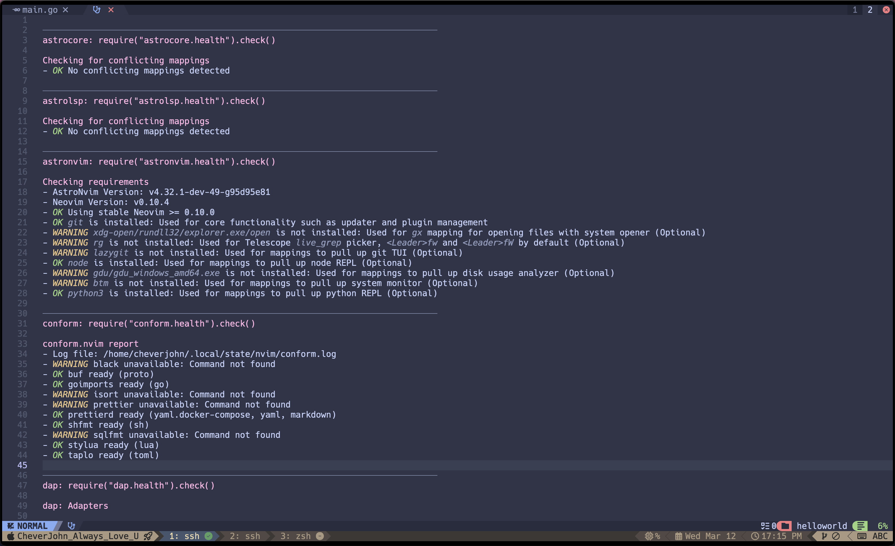

# 安装依赖组件

checkhealth 可以看到有很多告警。



## 安装 xdg-open

`xdg-open` 是 Ubuntu 中用于打开文件的系统命令，属于 `xdg-utils` 包。该命令在使用 Neovim 的 `gx` 映射打开文件/URL 时非常有用。

```shell
sudo apt-get install --reinstall xdg-utils
```

安装后验证：

```shell
which xdg-open  # 应该显示 /usr/bin/xdg-open
xdg-open --version  # 查看版本信息
```

## 安装 ripgrep (rg)

用于 Telescope 插件的文本搜索功能：

```shell
sudo apt-get install ripgrep
```


## 安装 lazygit

方便在 Neovim 中使用 Git 的 TUI 工具：

```shell
# 添加 lazygit PPA
sudo add-apt-repository ppa:lazygit-team/release
sudo apt-get update
sudo apt-get install lazygit
```

## 安装 gdu (磁盘使用分析器)

```shell
# 下载最新版本
curl -L https://github.com/dundee/gdu/releases/latest/download/gdu_linux_amd64.tgz | tar xz
# 移动到可执行目录
sudo mv gdu_linux_amd64 /usr/local/bin/gdu
```

## 安装 bottom (btm，系统监视器)

```shell
# 添加 bottom 仓库
curl -LO https://github.com/ClementTsang/bottom/releases/download/0.9.6/bottom_0.9.6_amd64.deb
# 安装
sudo dpkg -i bottom_0.9.6_amd64.deb
# 清理
rm bottom_0.9.6_amd64.deb
```

## 一键脚本安装

```bash
#!/bin/bash

# 安装 xdg-utils
sudo apt-get update
sudo apt-get install -y xdg-utils

# 安装 ripgrep
sudo apt-get install -y ripgrep

# 安装 lazygit
if ! command -v lazygit &> /dev/null; then
    sudo add-apt-repository -y ppa:lazygit-team/release
    sudo apt-get update
    sudo apt-get install -y lazygit
fi

# 安装 gdu
if ! command -v gdu &> /dev/null; then
    curl -L https://github.com/dundee/gdu/releases/latest/download/gdu_linux_amd64.tgz | tar xz
    sudo mv gdu_linux_amd64 /usr/local/bin/gdu
fi

# 安装 bottom
if ! command -v btm &> /dev/null; then
    wget https://github.com/ClementTsang/bottom/releases/download/0.9.6/bottom_0.9.6_amd64.deb
    sudo dpkg -i bottom_0.9.6_amd64.deb
    rm bottom_0.9.6_amd64.deb
fi

echo "所有工具安装完成，请重新启动 Neovim 检查依赖项"
```

## lazygit

https://github.com/jesseduffield/lazygit#ubuntu

```shell
LAZYGIT_VERSION=$(curl -s "https://api.github.com/repos/jesseduffield/lazygit/releases/latest" | \grep -Po '"tag_name": *"v\K[^"]*')
curl -Lo lazygit.tar.gz "https://github.com/jesseduffield/lazygit/releases/download/v${LAZYGIT_VERSION}/lazygit_${LAZYGIT_VERSION}_Linux_x86_64.tar.gz"
tar xf lazygit.tar.gz lazygit
sudo install lazygit -D -t /usr/local/bin/
```

